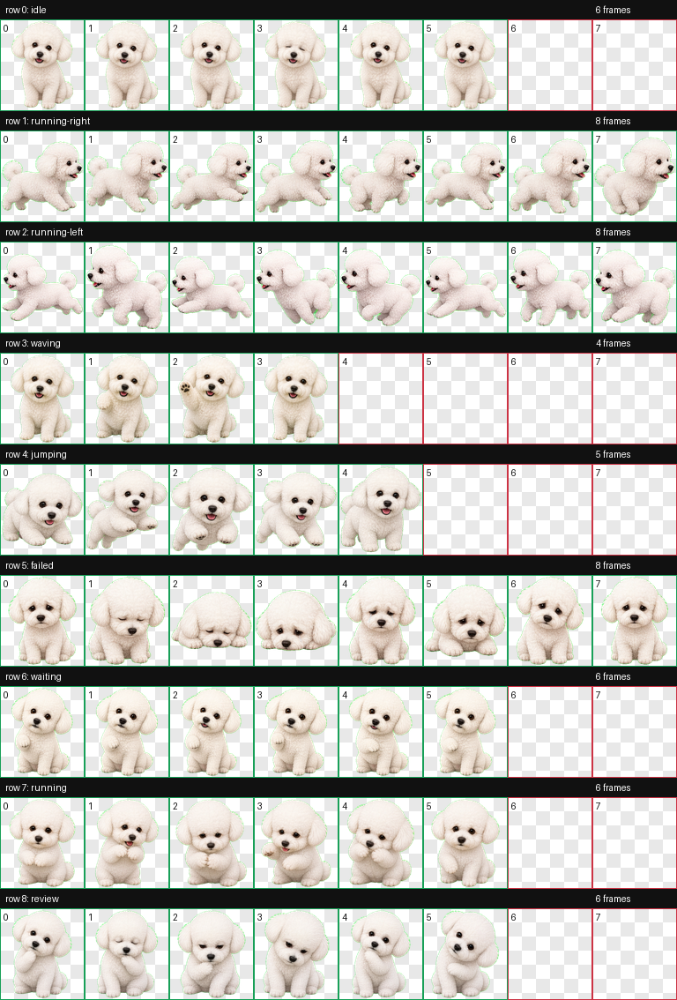

# Bichon / 熊熊 Codex Pet

[中文说明](README_zh_CN.md)

Bichon is a custom Codex pet based on 熊熊, a small white Bichon Frise with a round fluffy head, glossy dark eyes, a black button nose, floppy ears, and a sweet curious expression.

This repository contains a ready-to-install Codex pet package plus preview assets used to review the final animation.

## Preview

Original reference:


Generated Codex pet contact sheet:



Animation previews:

| Idle | Running Right | Waving | Jumping |
| --- | --- | --- | --- |
|  |  |  |  |

## Install

Copy the `bichon` folder into your Codex pets directory:

```bash
mkdir -p ~/.codex/pets
cp -R bichon ~/.codex/pets/
```

Then restart Codex and select the pet named `熊熊`.

## Package Contents

```text
bichon/
  pet.json
  spritesheet.webp
```

The pet id is `bichon`, and the display name is `熊熊`.

## Validation

The generated spritesheet was validated as:

- Format: WebP with alpha
- Size: `1536x1872`
- Cell size: `192x208`
- Rows: 9 Codex pet animation states
- Transparent pixel RGB residue: `0`
- Frame inspection: no errors or warnings

## Credits

Created from personal reference photos of 熊熊 using the Codex hatch-pet workflow.
